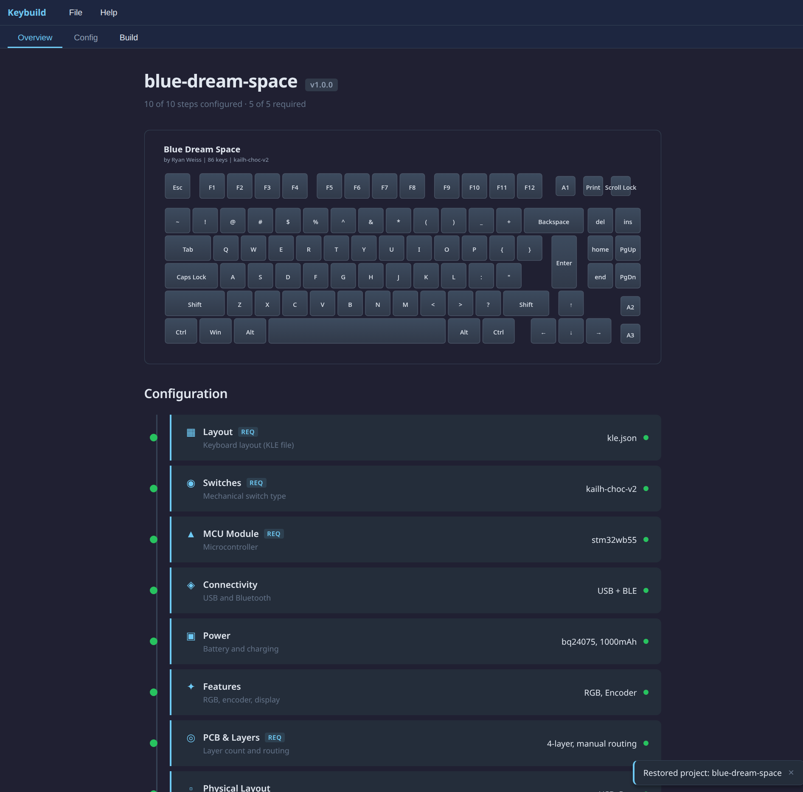
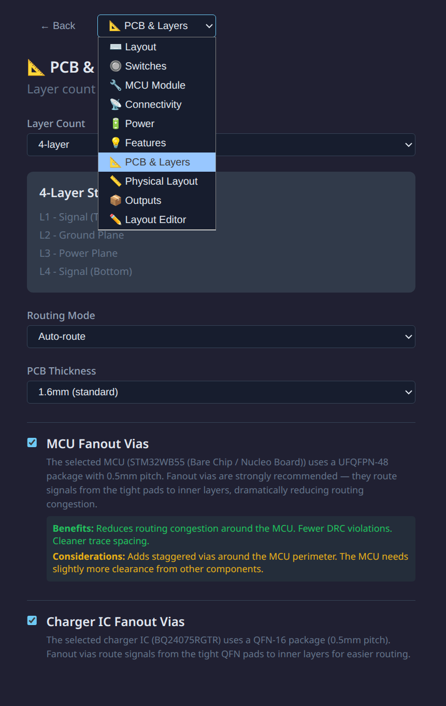
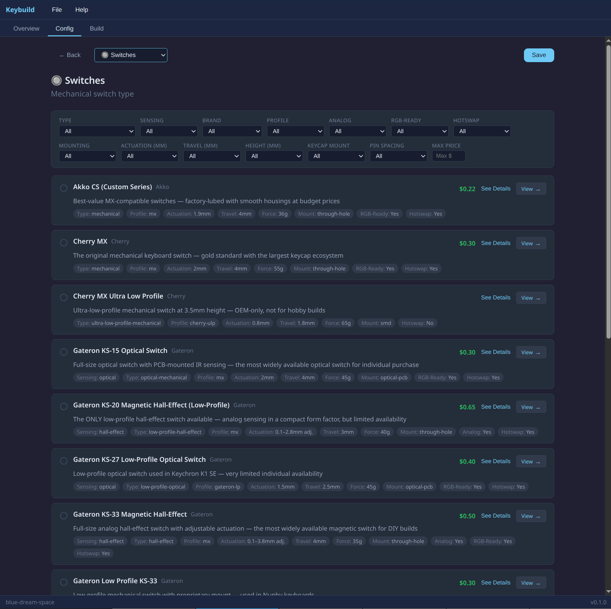
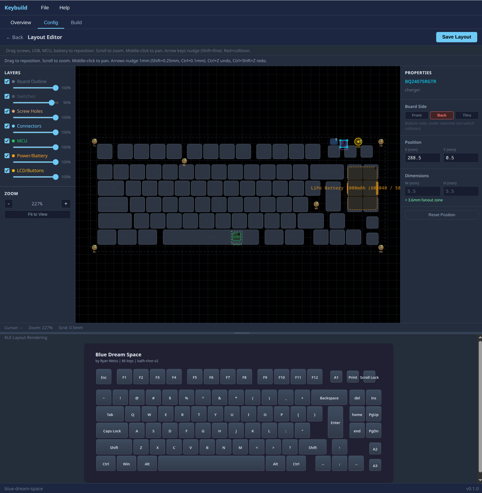
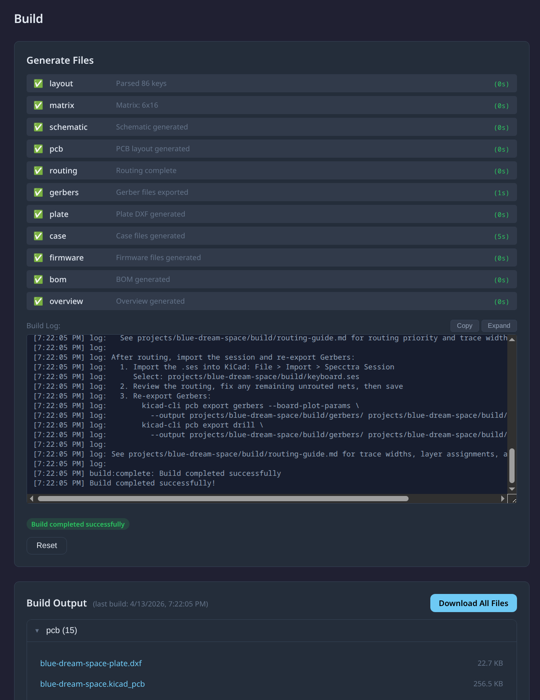
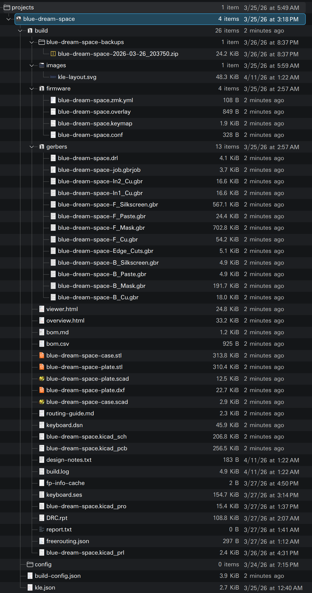
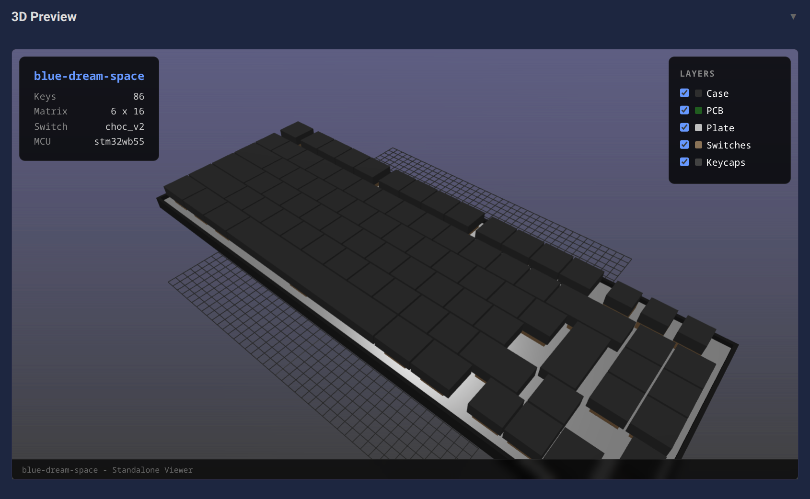

# Keybuild

A config-driven toolchain for designing and building custom mechanical keyboards from scratch. Takes a keyboard layout and component choices as input, generates KiCad schematics, PCB layouts, switch plates, 3D-printable cases, ZMK firmware, and a bill of materials — all from a single CLI tool. Includes a 3D web viewer for visualizing the assembled keyboard.

<p>
  <a href=".github/screenshots/screenshot_main.png"></a>
  <a href=".github/screenshots/screenshot_config_options.png"></a>
  <a href=".github/screenshots/screenshot_config_switches.png"></a>
  <a href=".github/screenshots/screenshot_layout_editor.png"></a>
  <a href=".github/screenshots/screenshot_build.png"></a>
  <a href=".github/screenshots/screenshot_file_output.png"></a>
  <a href=".github/screenshots/screenshot_3d_viewer.png"></a>
</p>

## Quick Start

```bash
# 1. Install prerequisites
./src/scripts/setup.sh

# 2. Install toolchain dependencies
cd src/tools && npm install

# 3. Run the interactive wizard
npx keybuild wizard
```

The wizard walks you through every design choice (layout, switches, MCU, connectivity, features, routing) and generates all project files into `projects/<name>/`.

## Features

### Interactive CLI Wizard

The main way to use the toolchain. Prompts you step-by-step through:

- **Layout** — point to a local KLE JSON file, paste a keyboard-layout-editor.com URL, or pick a built-in template
- **Switches** — browse supported switch families and variants, with detailed spec sheets for each
- **MCU** — select from supported nRF52840 modules with feature summaries and info screens
- **Connectivity** — USB-C (always on) + optional Bluetooth
- **Power** — battery capacity, charger IC selection with detailed comparisons
- **Features** — per-key RGB (above or below switch), underglow, rotary encoder
- **Physical layout** — USB port side (left/back/right), connector position and order, case height profile
- **PCB layers** — 2-layer (standard) or 4-layer (dedicated signal/power planes). For 4-layer, choose which inner layer carries the main switch traces
- **PCB routing** — auto (Freerouting), guided (generates instructions), or manual
- **Outputs** — checkbox selection of which files to generate

The confirmation screen shows estimated keyboard dimensions with an ASCII side-profile diagram before you proceed.

### Config-Driven Generation

Every build produces a `build-config.json` at the project root. You can re-run or tweak builds without the wizard:

```bash
cd src/tools

# Generate from an existing project config (no prompts)
npx keybuild generate --config ../../projects/blue-dream-space/build-config.json

# Re-generate and overwrite existing build
npx keybuild generate --config ../../projects/my-keyboard/build-config.json --overwrite

# Validate a config and see design warnings
npx keybuild validate --config ../../projects/my-keyboard/build-config.json
```

You can also pass a partial config to the wizard — it skips questions that are already answered:

```bash
npx keybuild wizard --config ./my-partial-config.json
npx keybuild wizard --kle-file ../../projects/my-keyboard/my-layout.json
```

### Project Output Structure

Each project gets its own folder under `projects/`:

```
projects/blue-dream-space/
├── blue-dream-space-kle.json       # KLE layout file
├── build-config.json               # Full build config (re-runnable)
├── config/                         # Additional config files
└── build/                          # Generated artifacts
    ├── *.kicad_sch                 # KiCad schematic (with embedded symbols)
    ├── *.kicad_pcb                 # KiCad PCB layout
    ├── *-plate.dxf                 # Laser-cut switch plate (DXF)
    ├── *-plate.scad / *-plate.stl  # 3D-printable plate (OpenSCAD + STL)
    ├── *-case.scad / *-case.stl    # 3D-printable case (OpenSCAD + STL)
    ├── *.step                      # PCB STEP file (for 3D assembly)
    ├── *-preview.svg               # 2D PCB preview (copper + silkscreen)
    ├── *-3d.png                    # 3D ray-traced PCB render
    ├── routing-guide.md            # PCB routing instructions
    ├── firmware/                   # ZMK firmware configs
    │   ├── *.overlay               # Devicetree overlay
    │   ├── *.keymap                # Default keymap
    │   ├── *.conf                  # Feature flags
    │   └── *.zmk.yml              # Shield metadata
    ├── bom.md / bom.csv            # Bill of materials
    ├── gerbers/                    # Gerber + drill files (if KiCad CLI available)
    ├── overview.html               # Project overview page (open in browser)
    ├── viewer.html                 # Standalone 3D viewer (no server needed)
    ├── design-notes.txt            # Warnings and design concerns
    └── build.log                   # Build parameters
```

### Preview & Validation

```bash
cd src/tools

# Generate 2D SVG + 3D PNG preview of a PCB
npx keybuild preview --pcb ../../projects/my-keyboard/build/my-keyboard.kicad_pcb

# Run Design Rule Check
npx keybuild drc --pcb ../../projects/my-keyboard/build/my-keyboard.kicad_pcb

# Export PCB as STEP for 3D assembly
npx keybuild export-step --pcb ../../projects/my-keyboard/build/my-keyboard.kicad_pcb
```

The `preview` command produces a layered SVG (copper, silkscreen, edge cuts) and a ray-traced 3D PNG using KiCad's built-in renderer.

The `drc` command reports violations, unconnected pads, errors, and warnings — useful for validating PCBs before fabrication.

### Project Overview Page

Each build generates an `overview.html` — open it directly in a browser for a complete project dashboard:

- **Specs table** — all key parameters (switches, MCU, battery, GPIO usage, matrix, etc.)
- **Physical dimensions** — width, depth, front/rear height with ASCII side profile
- **Design notes** — color-coded warnings and info from the validator
- **Embedded 3D viewer** — interactive Three.js viewer with layer toggles, inline in the page
- **File browser** — all generated artifacts with inline image previews, code previews for text files, and download links

A standalone `viewer.html` is also generated — works without a server by embedding the config directly.

### 3D Web Viewer

Visualize your keyboard build in 3D directly in the browser:

```bash
# Option 1: Open the standalone viewer directly
xdg-open projects/blue-dream-space/build/viewer.html

# Option 2: Start the server-based viewer (supports live file loading)
cd src/tools
npx keybuild viewer --dir ../../projects/blue-dream-space/build
```

The viewer provides:
- **Layer toggles** — show/hide PCB, plate, case, switches, keycaps independently
- **Info panel** — project name, key count, matrix size, switch type, MCU
- **Orbit controls** — drag to rotate, scroll to zoom, right-drag to pan
- Reads the actual KLE layout for accurate key positioning and sizes

### 3D Case & Plate Generation

The build pipeline automatically generates parametric OpenSCAD files for the switch plate and case:

- **Plate** — rounded corners, per-key switch cutouts, stabilizer cutouts for wide keys, smart-positioned mounting holes
- **Case** — matching outline with walls, USB-C cutout on configurable side, battery compartment (if BLE), minimal front height with no standoffs for the thinnest possible profile

Mounting holes are positioned using a smart algorithm that finds empty areas between switches — no screws will overlap with any component.

If OpenSCAD is installed, STL files are compiled automatically. Otherwise, `.scad` files are output for manual compilation.

The `.scad` files are parametric — edit them to adjust wall thickness, corner radius, heights, etc.

### 3D Assembly (FreeCAD)

For a combined 3D model of the full keyboard assembly:

```bash
freecadcmd src/tools/src/3d-assembler/assemble.py \
  --pcb projects/my-keyboard/build/my-keyboard.step \
  --plate projects/my-keyboard/build/my-keyboard-plate.stl \
  --case projects/my-keyboard/build/my-keyboard-case.stl \
  --output projects/my-keyboard/build/assembled.step
```

Positions the PCB, plate, and case at correct heights and exports a combined STEP.

### PCB Routing

Three modes, selectable in the config or wizard:

- **`auto`** — Exports to Specctra DSN (via KiCad Python API), runs [Freerouting](https://github.com/freerouting/freerouting) headless, imports routed traces back. Falls back gracefully if tools aren't installed.
- **`guided`** — Generates a detailed routing guide with trace priority order, layer assignments, and width recommendations. Includes instructions for running Freerouting manually.
- **`manual`** — Outputs the unrouted PCB + routing guide. You handle routing entirely in KiCad.

* Note: The automated freerouting will not complete, usually. In normal circuits, it will get hung up on the last 5 traces or so. This is expected.
Instead of "auto" freerouting from the wizard, you should run the Freerouting manually after a build (as the Build Output will explain, if it can't complete).
For example, with the latest freerouting jar:
1. Run: java -jar /home/<user>/.local/bin/freerouting-2.1.0.jar -de <keybuild-root>/projects/<project>/build/keyboard.dsn
(then click 'Start the auto-router', in the opened freerouter window, and wait... it will take 5-15 minutes or so)
2. In Freerouting GUI: File → Export Specctra Session
3. Save as: <keybuild-root>/projects/<project>/build/keyboard.ses
4. Then import in KiCad PCB: File → Import → Specctra Session

### Component Database

All supported components live in `data/` as JSON files. The wizard loads these to populate its selection menus with detailed spec sheets, and the BOM generator pulls prices and supplier links from them.

```bash
cd src/tools

# Browse available components
npx keybuild list-components
npx keybuild list-components --type switches
npx keybuild list-components --type mcus
```

**Supported switches:** Kailh Choc v1/v2, Cherry MX ULP, Cherry MX, Gateron Low Profile
**Supported MCUs:** nice!nano v2, Seeed XIAO BLE, SuperMini nRF52840, Holyiot 18010, bare nRF52840

Adding a new component: create a JSON file in the appropriate `data/` subdirectory following the existing format. It will automatically appear in the wizard with its specs and supplier info.

### ZMK Firmware

Generated firmware configs are ready to build with ZMK:

```bash
# Build firmware (requires west/Zephyr — installed by setup.sh)
cd src/firmware
./build.sh blue_dream_space nice_nano_v2

# Flash to keyboard
./flash.sh ../../projects/firmware-builds/blue_dream_space_nice_nano_v2.uf2
```

The flash script auto-detects the bootloader drive. Double-tap reset on your board to enter bootloader mode.

### KLE Layout Renderer

The build pipeline automatically generates an SVG rendering of your keyboard layout from the KLE JSON file. The image is saved to `build/images/kle-layout.svg` and shown in the web wizard's Overview and Layout config pages.

If `sharp` is installed (`npm install sharp` in src/tools), the renderer also produces a PNG version. Otherwise SVG is used — both work in browsers and the overview HTML.

### Web Wizard (GUI)

A full web application alternative to the CLI wizard:

```bash
cd src/wizard
npm install
npm run dev
```

Opens at `http://localhost:5173` with:
- **File menu** — New/Open/Save projects, About
- **Overview tab** — all config steps with completion status, layout preview image
- **Config tab** — select options for each step with product detail pages for every component
- **Build tab** — trigger generation with SSE progress streaming, view output files
- **Layout Editor** — 2D canvas for repositioning screws, USB, MCU with drag-and-drop
- **Part Detail Pages** — `/parts/:category/:id` with full specs, features, concerns, supplier links

The web wizard shares the same backend generators as the CLI and saves to the same project files.

## CLI Command Reference

All commands run from `src/tools/`:

| Command | Description |
|---------|-------------|
| `npx keybuild wizard` | Interactive build wizard |
| `npx keybuild generate -c <config>` | Generate from config file (no prompts) |
| `npx keybuild validate -c <config>` | Validate config and show design concerns |
| `npx keybuild list-components` | Browse component database |
| `npx keybuild preview -p <pcb>` | Render 2D SVG + 3D PNG of PCB |
| `npx keybuild drc -p <pcb>` | Run Design Rule Check |
| `npx keybuild export-step -p <pcb>` | Export PCB as STEP file |
| `npx keybuild viewer -d <build-dir>` | Start 3D web viewer |

## Directory Structure

```
├── projects/         User projects — each with layout, config, and build output
├── data/             Component database (JSON files for switches, MCUs, etc.)
├── src/
│   ├── tools/        Node.js/TypeScript toolchain (Keybuild CLI)
│   │   └── src/
│   │       ├── cli/              Interactive wizard and commands
│   │       ├── kle-parser/       KLE JSON layout parser
│   │       ├── matrix-generator/ Switch matrix optimizer
│   │       ├── kicad-generator/  Schematic + PCB generators
│   │       ├── plate-generator/  DXF plate generator
│   │       ├── case-generator/   OpenSCAD case/plate 3D generator
│   │       ├── firmware-generator/ ZMK config generator
│   │       ├── bom-generator/    Bill of materials generator
│   │       ├── routing/          PCB auto-routing (Freerouting integration)
│   │       ├── preview/          SVG/PNG preview and DRC
│   │       ├── viewer/           Three.js 3D web viewer
│   │       ├── 3d-assembler/     FreeCAD assembly script
│   │       ├── overview-generator/ Project overview HTML generator
│   │       └── build/            Build orchestrator
│   ├── firmware/     ZMK firmware workspace + build/flash scripts
│   └── scripts/      Setup and prerequisite installation scripts
└── docs/             Design research and reference documents
```

## Prerequisites

Run `./src/scripts/setup.sh` to install everything, or install manually:

| Tool | Required | Purpose |
|------|----------|---------|
| **Node.js 20+** | Yes | Runs the toolchain |
| **KiCad 9+** | Optional | Gerber/STEP export, 3D render, DRC, PCB editing |
| **OpenSCAD** | Optional | Compiles parametric case/plate to STL |
| **Java 11+** | Optional | Runs Freerouting (auto-routing) |
| **Freerouting** | Optional | Automated PCB trace routing |
| **FreeCAD** | Optional | 3D model assembly (PCB + case + plate) |
| **west (Zephyr)** | Optional | Building ZMK firmware from source |

Check what's installed:

```bash
./src/scripts/setup-check.sh
```

The toolchain generates KiCad and OpenSCAD files without those tools installed — you only need them to open/edit the files, compile STLs, or export Gerbers.

## Design Decisions

- **nRF52840** — Single chip with native USB 2.0 + BLE 5.0. No external radio module needed.
- **ZMK firmware** — First-class wireless support, built on Zephyr RTOS. Auto-switches between USB and BLE.
- **Dual switch support** — Same electrical matrix, different physical footprints. Select via config.
- **Config-driven** — Everything flows from one JSON. Change it, re-run, get new files.
- **Smart matrix optimizer** — Automatically rebalances the switch matrix to fit within the selected MCU's GPIO count. An 86-key layout fits on a 21-GPIO nice!nano (11x10 matrix).
- **Multi-layer PCB** — Supports 2-layer (standard, most affordable) and 4-layer boards (dedicated signal/power planes, better routing). For 4-layer, you choose which inner layer carries the main switch traces — the autorouter and routing guide adapt accordingly.
- **KiCad 9 native** — Generated schematics embed symbol definitions from your installed KiCad libraries. PCB files use the v20240108 format with proper quoting and layer definitions.
- **Thin profile** — Default case height is minimal: 0.8mm case bottom + 1.6mm PCB + 1.5mm plate = ~3.9mm front. No standoffs at the front edge. Rear is slightly taller for USB clearance. User can customize both heights.
- **Smart screw placement** — Mounting holes are automatically positioned to avoid all switches and components, staying as close to corners and midpoints as possible while maintaining clearance.

## Tips

- The **nice!nano v2** has 21 GPIOs. The matrix optimizer handles layouts up to ~100 keys on 21 GPIOs by rebalancing rows/columns automatically.
- Cherry MX **ULP switches** require reflow soldering and SLA-printed keycaps. The wizard flags this automatically.
- The `build-config.json` at each project root is re-runnable. Edit it and pass it back to `generate` for quick iterations.
- Run `validate` on a config before `generate` to catch issues early — it checks GPIO budgets, charging rates, switch/hot-swap compatibility, etc.
- Layouts from [keyboard-layout-editor.com](http://www.keyboard-layout-editor.com/) — use the "Download JSON" button and save into your project folder.
- If a build already exists, the tool will warn you. Use `--overwrite` to replace it silently.
- The 3D viewer reads your actual KLE layout for accurate key positioning — works best when `layout.json` is in the build directory.
- **4-layer boards** significantly improve auto-routing success. A 2-layer board may leave 5-10 unrouted connections (typically MCU power pins) that need manual cleanup. A 4-layer board with signal traces on In1.Cu often routes 100%.
- Per-key RGB LEDs can be placed **above** (for shine-through keycaps) or **below** (reverse-mount, light shines through PCB) the switch — the wizard asks during setup.
- USB port can be placed on the **left**, **right**, or **back** edge. For back placement, choose left/center/right position and USB-first or power-first order.
- Open `overview.html` from any build for a complete project dashboard — no server needed, works directly in the browser.

## Running Tests

```bash
cd src/tools && npm test
```

## Contributing

Contributions are welcome! Feel free to try out the toolchain, explore the codebase, and submit improvements.

**How to contribute:**

1. Fork the repo and create a feature branch (`git checkout -b my-feature`)
2. Make your changes, ensuring tests pass (`cd src/tools && npm test`)
3. Submit a Pull Request describing what you changed and why

Bug fixes, feature implementations, documentation improvements, and new component data are all appreciated. Please keep PRs focused — one feature or fix per PR.

**Using AI assistants is recommended.** This project was largely built with [Claude Code](https://claude.ai/code) (Claude Opus 4.6) and is well-suited for AI-assisted development. The repo includes a `CLAUDE.md` file at the root with up-to-date project context, architecture decisions, and build instructions — it's automatically loaded by Claude Code and provides good initial context for any AI assistant working on the codebase.

If you're using Claude Code or another AI tool, point it at `CLAUDE.md` first to get oriented, then explore the implementation plan at `.claude/plans/` for deeper architectural context.
